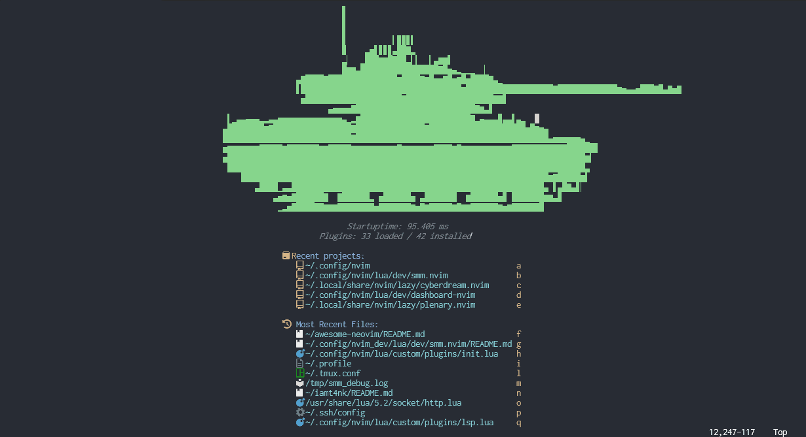

> [!CAUTION]
> This repo is archived as Spotify has deemed it unnecesary to allow individual contributors to make their own apps. Rather, they believe that only other organizations should be able to publish full-access apps that utilize their API. [https://developer.spotify.com/documentation/web-api/concepts/quota-modes](https://developer.spotify.com/documentation/web-api/concepts/quota-modes). At this point, there's no use continuing developing on this. If you would like to clone this repo and register your own app, by all means go for it.

# Spotify Music Manager - Neovim

> [!WARNING]  
> This plugin is currently in beta, of which there are limited spots. To sign up for the beta program, sign up [here](https://www.surveymonkey.com/r/FQSSS57).  

> [!CAUTION]  
> Currently the Spotify API does not allow free users to make any changes to playback. If you are a free user. Then please note you will still be able to view playback. But you will be unable to make any playback changes directly via the app. Unfortunately, there is nothing I can do about that.

SMM.nvim is a simple, minimal implementation for Spotify that allows users (currently) to view and control their current Spotify playback. This plugin does NOT stream any music itself, but rather it controls the current spotify player (regardless of device).

Spotify Apps that use the [Spotify Web API](https://developer.spotify.com/documentation/web-api) do not allow you to specify a webhook. This pretty much means that the only thing we can do on the plugin is send requests every so often to sync with the servers.



### Installation:

Create an app for the Spotify API using: [this link](https://developer.spotify.com/documentation/web-api).

Use the following configurations when installing this plugin:  

- LazyVim:  
```lua
{
   'iamt4nk/smm.nvim',
   dependencies = {
     'nvim-lua/plenary.nvim',
     'nvim-telescope/telescope.nvim',
   },
   config = {
      premium = true,
      -- debug = true,                    -- These can be used in case there are any issues and you need to debug.
      -- file = '/tmp/smm_debug.log'
      playback = {
         timer_update_interval = 250,     -- How often the timer itself is  updated in ms
         timer_sync_interval = 5000,      -- How often sync requests are sent to the server in ms
         interface = {
            playback_pos = 'BottomRight', -- Options { 'TopLeft', 'TopRight', 'BottomLeft', 'BottomRight' }
            playback_width = 40,          -- Width of the playback window
            progress_bar_width = 35,      -- Width of the progress bar
         },
      },

      spotify = {
         api_retry_max = 3,               -- The number of times to retry before failing out.
         api_retry_backoff = 2000,
         auth = {                         -- These are the only absolutely required configurations.
            client_id = '<your client id>',
            callback_url = '<your callback URL>',
            callback_port = '<your callback port>',
         },
      },
   },
},
```
> [!NOTE]
> Use the "nightly" branch for regular, _lightly tested_ updates.

(Feel free to add a PR with instructions to install for your package manager.)

### Execution
To run this plugin for the first time run the command:
```
:Spotify
```

This will initiate an OAuth procedure, which, once completed will store a refresh token in your `$HOME/.local/state/nvim/spotify` directory, as well as store an api access token in memory.

Afterwards, it will also bring up the playback window with which you can view playback. You can run the same command again to git rid of the playback window.

#### Commands
There are a few other commands you can currently run if you are a Spotify Premium User:
- `:Spotify auth`: Re-authorizes with the Spotify app in case there are issues
- `:Spotify pause`: Pauses current song  
- `:Spotify resume`: Resumes current song  
- `:Spotify play [artist|album|song|playlist] <query>`: Searches for the query and then starts playback from the selection.
- `:Spotify change_device`: Changes the device spotify is currently playing on.
- `:Spotify next`: Skip to the next song (if available)
- `:Spotify prev`: Go to the previous song (if available)

> [!NOTE]
> Spotify unfortunately does not allow starting a playback session from a device. Playback must initially start from the Spotify desktop/mobile/web app. When switching to another device, the Spotify app must be open on that device before switching.
